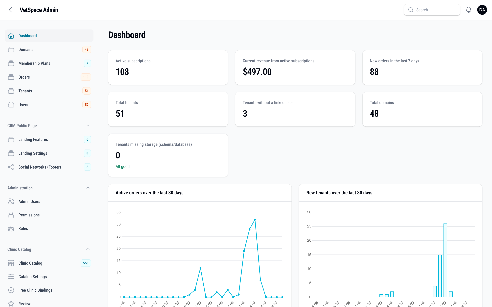
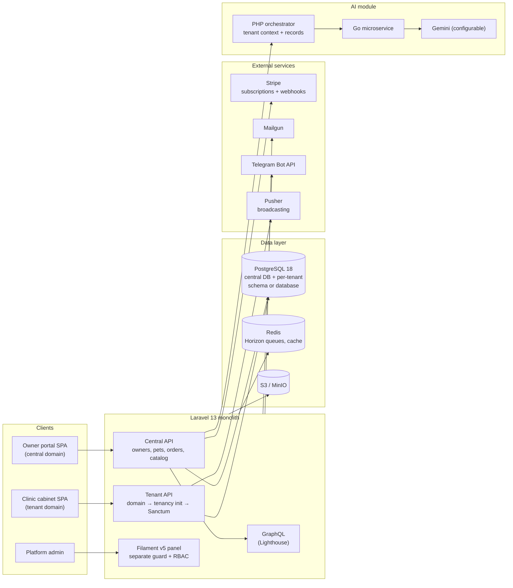
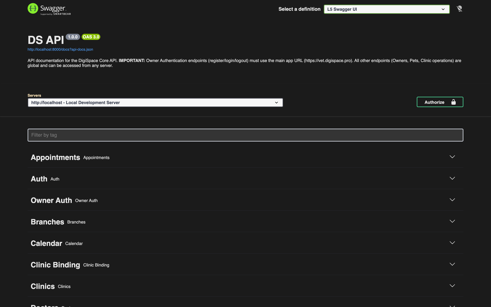
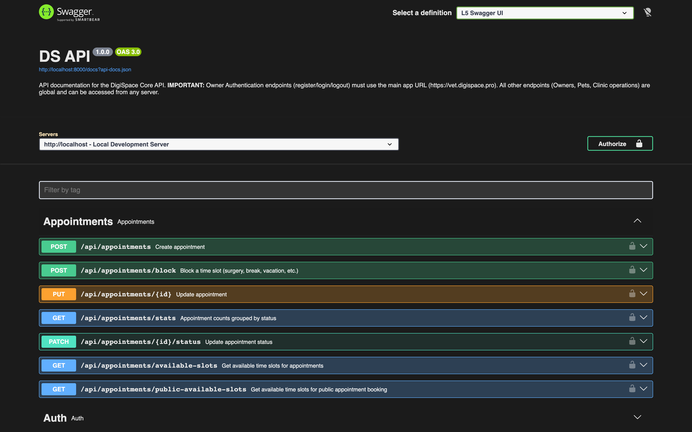
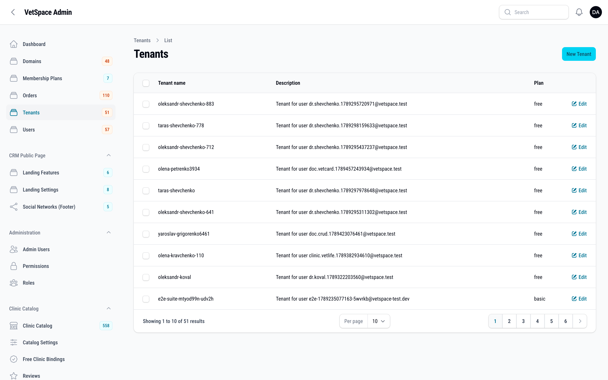
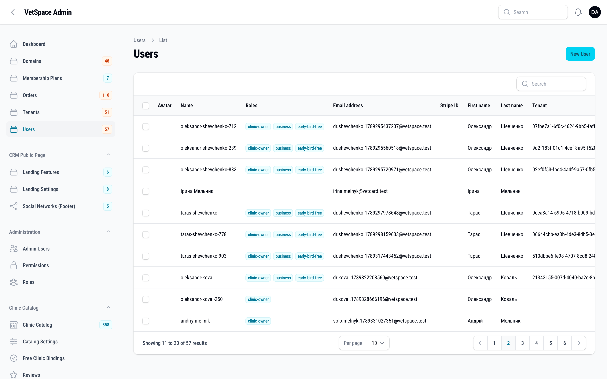
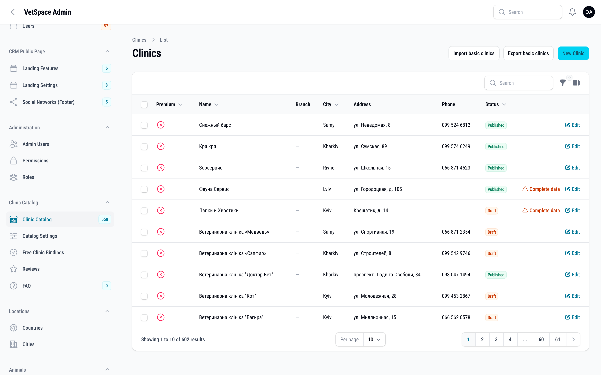
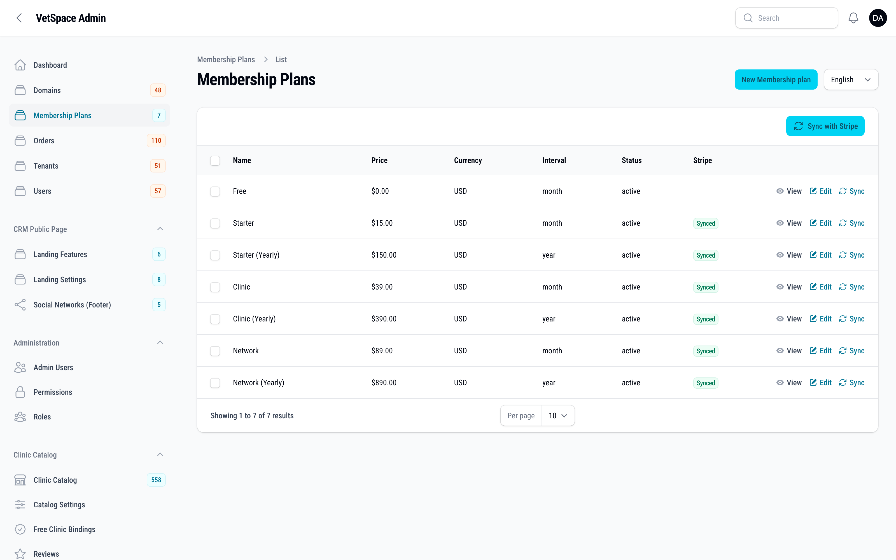
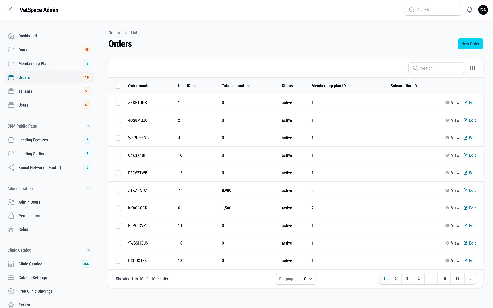
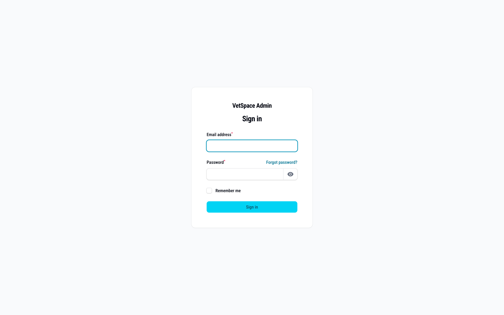

# VetSpace API — Platform Overview

> Backend of a multi-tenant SaaS platform for veterinary clinics: appointment scheduling, clinic CRM, pet-owner portal, subscriptions, AI-assisted analysis, and a full admin panel.
>
> **The source code is private.** This repository is a public technical overview — architecture, domain specifications written in the project's own OpenSpec format, and screenshots of the API documentation and admin panel.
>
> **Staging:** [API documentation (Swagger UI)](https://vet.digispace.pro/api/documentation) · [Admin panel](https://vet.digispace.pro/admin) *(requires credentials)*
>
> **Production:** [vetcard.pro](https://vetcard.pro) · [vetspace.pro](https://vetspace.pro) — the platform is live in production.
>
> **Companion repositories:** [vetspace-frontend](https://github.com/Yurij2015/vetspace-frontend) (clinic CRM panel & marketing site) · [vetspace-vetcard](https://github.com/Yurij2015/vetspace-vetcard) (public clinic portal & booking)



---

## What it does

VetSpace is a SaaS platform where every veterinary clinic gets its own subdomain and fully isolated data, while pet owners live in a shared central space:

- **Clinic cabinet (tenant domains)** — branches, rooms, doctors, services, appointment scheduling with slot availability, calendar events, reviews, public (unauthenticated) booking pages.
- **Owner portal (central domain)** — registration/auth, pets, orders & checkout, VetCard bindings to clinics, profile, notification preferences, active sessions.
- **Platform admin** — Filament panel for tenants, domains, users, membership plans, orders, clinic catalog, landing page content, roles & permissions.
- **AI module** — PHP orchestrator + a Go microservice that calls the configured AI provider (Gemini by default) for visit/data analysis, with per-tenant prompt overrides.

## Architecture



### Highlights

- **Hybrid multi-tenancy** ([stancl/tenancy](https://tenancyforlaravel.com/) v3): tenant isolation is decided *per plan* — `enterprise` tenants get a dedicated PostgreSQL **database**, everyone else gets a PostgreSQL **schema** inside the central DB. Tenant IDs are UUIDs.
- **Two routing contexts in parallel**: central API (`/api` on the main domain) and tenant API (`/api` on each clinic's domain), with domain-based tenancy middleware reordered to run *before* Sanctum auth so tokens resolve against the tenant DB.
- **Event-driven notifications**: booking events fan out to email (Mailgun) and Telegram via queued notifications with per-user channel preferences and email-verification gates.
- **Real-time updates**: appointment and calendar events broadcast over WebSockets (Pusher protocol).
- **Spec-driven development**: behavioural contracts are maintained as OpenSpec specs (OKF frontmatter, domain-grouped) — see [`openspec/specs/`](openspec/specs/) in this repo for the public-facing set.
- **Documentation layers**: product truth in PRDs, behaviour truth in OpenSpec, API truth in generated Swagger/OpenAPI, operational truth in runbooks.

## Tech stack

| Layer | Technology |
|---|---|
| Framework | Laravel 13, PHP 8.5 |
| Database | PostgreSQL 18 — hybrid DB/schema per-tenant isolation |
| Cache / Queue | Redis (Predis), Laravel Horizon |
| Admin panel | Filament v5 (+ access control, translatable fields) |
| API docs | OpenAPI 3.0 via L5-Swagger (~140 REST routes) |
| GraphQL | Lighthouse |
| Auth | Laravel Sanctum, Socialite (OAuth) |
| Payments | Laravel Cashier (Stripe subscriptions, webhooks) |
| Broadcasting | Pusher |
| Mail | Mailgun (Symfony mailer) |
| AI provider | Go microservice → Gemini (configurable) |
| Storage | S3 / MinIO |
| Observability | Sentry, Laravel Telescope, Pulse |
| Testing | Pest 4 / PHPUnit 12 — 1100+ tests (unit / integration / feature) |

## Screenshots

### OpenAPI documentation (Swagger UI)





### Filament admin panel

| | |
|---|---|
|  |  |
|  |  |
|  |  |

## Repository layout

```
openspec/specs/       Public-facing behavioural specs (OpenSpec / OKF format)
  architecture/       System overview, multi-tenancy boundaries
  appointments/       Booking, availability, lifecycle
  notifications/      Email/Telegram delivery & preferences
  billing/            Stripe subscriptions & webhooks
  auth/               API authentication model
  ai/                 AI analysis module
  admin/              Admin panel surface
docs/screenshots/     Swagger UI + Filament admin screenshots
```

## Status

Portfolio / documentation repository. Application source code, infrastructure, and product documents are private.

---

## Explore & contact

- **[Browse the live API documentation](https://vet.digispace.pro/api/documentation)** — full OpenAPI surface with try-it-out
- **[Read the domain specs](openspec/specs/)** — behavioural contracts in the project's OpenSpec format
- **[Production sites](https://vetcard.pro)** — vetcard.pro · vetspace.pro
- **Companion repos:** [vetspace-frontend](https://github.com/Yurij2015/vetspace-frontend) · [vetspace-vetcard](https://github.com/Yurij2015/vetspace-vetcard)

Built and maintained by **[Yurii Mokryi](https://yuriimokryi.vercel.app/)** — product owner & lead developer.

[Portfolio](https://yuriimokryi.vercel.app/) · [LinkedIn](https://www.linkedin.com/in/yurii-mokryi/) · [Telegram](https://t.me/YuriiMokryi) · [GitHub](https://github.com/Yurij2015)
